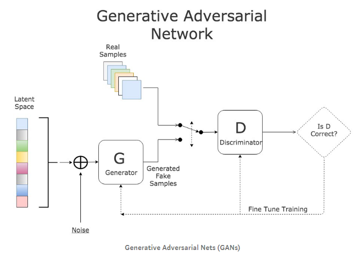

## Deep Convolutional Generative Adversarial Networks (DCGANs)

DCGANs consists of a Generator model and a Discriminator model. The Generator's role is to generate fake images, when provided with a vector in the latent space. The Discriminator's role is to differentiate between real and fake images. The code for these 2 models are found in `generator.py` and `discriminator.py` This can be seen below:

During training, in each batch, the batch consists of real and fake images and it is used to train the Discriminator first. After that, the weights of the driscriminator are frozen and a batch of fake images are generated from the generator, which is all marked as 'real' images to train the generator. These details can be seen in `train.py`.

This repo is used to generate fake images similar to the Fashion MNIST dataset. To do that, run the following command: `python train.py`.

